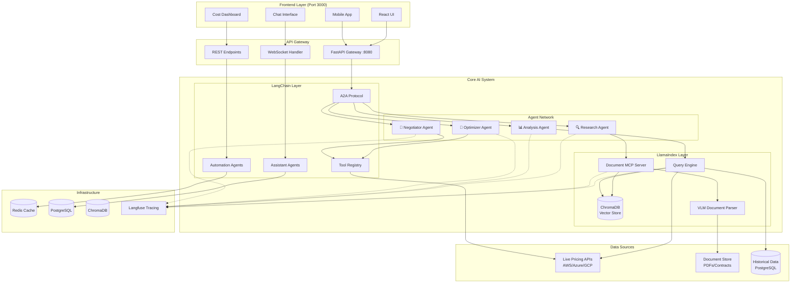
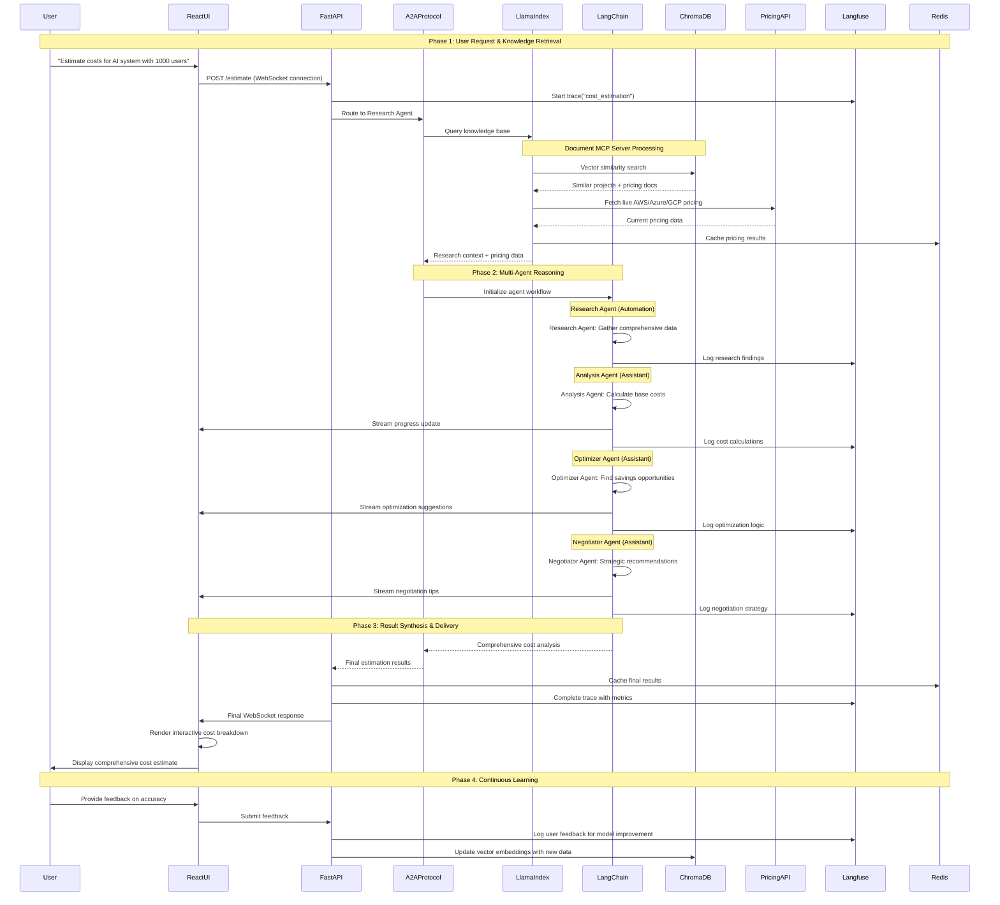
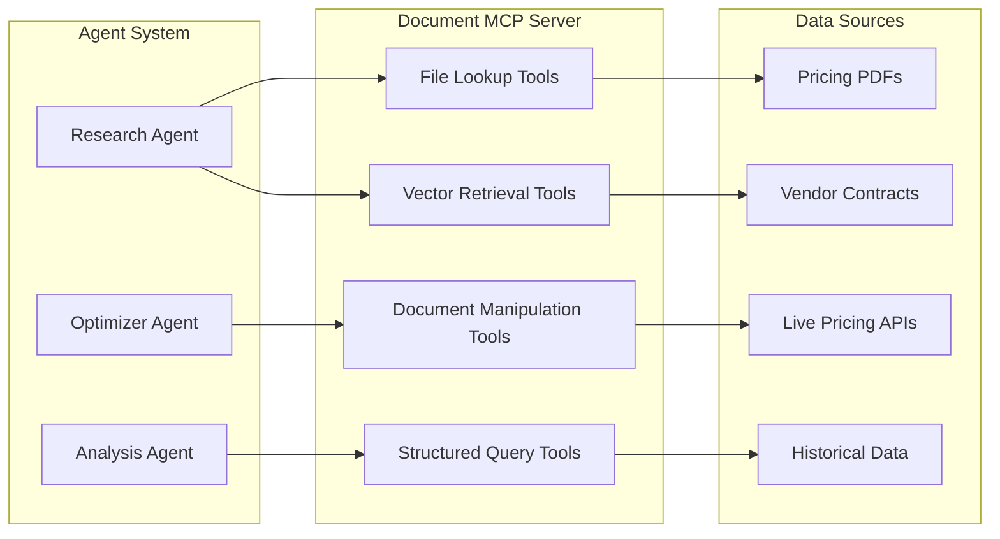
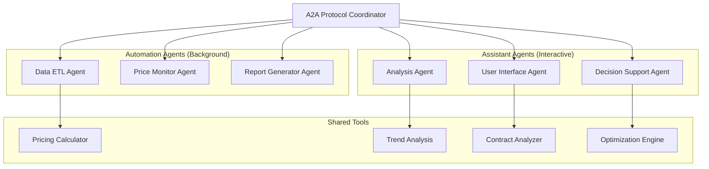

# Cost Estimator Agent: LlamaIndex + LangChain Architecture

## 🎯 Vision: Intelligent Cost Research Assistant

Transform from simple cost calculator to intelligent assistant that:
- **Researches** pricing from documents, APIs, contracts using LlamaIndex RAG
- **Reasons** through complex cost scenarios using LangChain agents
- **Negotiates** and optimizes based on historical data and market intelligence
- **Traces** every decision for transparency using Langfuse observability

## 🏗️ Final Architecture Diagram

### **Complete System Architecture**



## 📊 Sequence Diagram: Complete Cost Estimation Flow

### **End-to-End User Journey**



## 🔧 Component Interaction Details

### **MCP (Model Context Protocol) Integration**



### **A2A (Agent-to-Agent) Protocol Flow**



## 🧠 **LlamaIndex: The Knowledge Layer**

### What LlamaIndex Handles:
```python
# Knowledge Management & RAG
class CostKnowledgeBase:
    def __init__(self):
        self.index = VectorStoreIndex.from_documents([
            # Pricing Documents
            load_pdfs("data/aws_pricing/"),
            load_pdfs("data/azure_pricing/"),
            load_pdfs("data/gcp_pricing/"),

            # Historical Data
            load_csv("data/historical_costs.csv"),
            load_json("data/vendor_contracts/"),

            # Market Research
            load_web_docs("pricing_comparison_sites/"),
        ])

        self.query_engine = self.index.as_query_engine(
            similarity_top_k=5,
            response_mode="tree_summarize"
        )

    async def research_pricing(self, query: str):
        """Intelligent document retrieval"""
        return await self.query_engine.aquery(query)

    async def find_similar_projects(self, specification):
        """Find similar past projects for cost baseline"""
        return await self.query_engine.aquery(
            f"Find projects similar to: {specification}"
        )
```

### LlamaIndex Strengths:
- ✅ **Superior RAG** - Best document understanding
- ✅ **Multi-modal** - PDFs, APIs, databases, web
- ✅ **Graph queries** - Structured data relationships
- ✅ **Advanced retrieval** - Hybrid search, reranking
- ✅ **Knowledge graphs** - Connect related concepts

## 🤖 **LangChain: The Reasoning Layer**

### What LangChain Handles:
```python
# Multi-Agent Orchestration
class CostEstimationOrchestrator:
    def __init__(self, knowledge_base: CostKnowledgeBase):
        self.knowledge_base = knowledge_base

        # Multi-agent system
        self.agents = {
            "researcher": self._create_research_agent(),
            "analyzer": self._create_analysis_agent(),
            "optimizer": self._create_optimization_agent(),
            "negotiator": self._create_negotiation_agent()
        }

        # Tools for agents
        self.tools = [
            PricingAPITool(),
            CostCalculatorTool(),
            ContractAnalyzerTool(),
            OptimizationTool(),
            CalendarTool()  # For scheduling negotiations
        ]

    async def estimate_with_reasoning(self, specification):
        """Multi-step intelligent estimation"""

        # Step 1: Research (LlamaIndex)
        research_context = await self.knowledge_base.research_pricing(
            f"Pricing for {specification.description}"
        )

        # Step 2: Multi-agent reasoning (LangChain)
        workflow = SequentialAgentWorkflow([
            ("researcher", "Gather comprehensive pricing data"),
            ("analyzer", "Analyze costs and identify variables"),
            ("optimizer", "Find cost optimization opportunities"),
            ("negotiator", "Suggest negotiation strategies")
        ])

        return await workflow.run(
            input=specification,
            context=research_context,
            tools=self.tools
        )
```

### LangChain Strengths:
- ✅ **Agent orchestration** - Complex multi-step workflows
- ✅ **Tool integration** - APIs, functions, external services
- ✅ **Memory management** - Conversation and context tracking
- ✅ **Workflow engines** - Sequential, parallel, conditional flows
- ✅ **Function calling** - Structured tool use

## 🔍 **Langfuse: Complete Observability**

### Tracing Both Systems:
```python
# Unified observability
class TracedCostEstimator:
    def __init__(self):
        self.langfuse = Langfuse()
        self.llamaindex_tracer = LlamaIndexLangfuseTracer()
        self.langchain_tracer = LangChainLangfuseTracer()

    async def estimate_with_full_tracing(self, specification):
        with self.langfuse.trace("cost_estimation") as trace:

            # Trace LlamaIndex RAG
            with trace.span("knowledge_retrieval") as rag_span:
                context = await self.knowledge_base.research(specification)
                rag_span.update(
                    input=specification,
                    output=context,
                    metadata={"retrieval_method": "vector_similarity"}
                )

            # Trace LangChain reasoning
            with trace.span("agent_reasoning") as agent_span:
                result = await self.orchestrator.run(specification, context)
                agent_span.update(
                    input={"spec": specification, "context": context},
                    output=result,
                    metadata={"agents_used": ["researcher", "analyzer", "optimizer"]}
                )

            return result
```

## 📋 **Implementation Plan (Simple & Focused)**

### **Phase 1: LlamaIndex Knowledge Base (Week 1)**
```python
# Day 1-2: Document ingestion
- Load AWS/Azure/GCP pricing PDFs
- Create vector embeddings
- Set up query engine

# Day 3-4: RAG optimization
- Add reranking
- Implement hybrid search
- Test retrieval quality

# Day 5: Integration
- Connect to FastAPI backend
- Add caching layer
```

### **Phase 2: LangChain Agent System (Week 2)**
```python
# Day 1-2: Core agents
- Research agent (uses LlamaIndex)
- Analysis agent (cost calculations)
- Optimization agent (recommendations)

# Day 3-4: Tools integration
- Live pricing APIs
- Cost calculators
- External services

# Day 5: Workflow orchestration
- Sequential workflows
- Error handling
- Memory management
```

### **Phase 3: Frontend Separation (Week 3)**
```python
# Day 1-2: React setup
- Modern UI with real-time updates
- WebSocket for streaming results
- Interactive cost visualization

# Day 3-4: Integration
- Connect to FastAPI backend
- Real-time agent progress
- Cost breakdown visualization

# Day 5: Polish
- Mobile responsive
- Error handling
- User experience optimization
```

### **Phase 4: Langfuse Observability (Week 4)**
```python
# Day 1-2: Tracing setup
- LlamaIndex trace integration
- LangChain trace integration
- Custom metrics

# Day 3-4: Dashboard
- Agent performance metrics
- Cost estimation accuracy
- User interaction patterns

# Day 5: Production ready
- Alerting
- Performance monitoring
- Cost optimization tracking
```

## 🎯 **Real Example: Legal Assistant Pattern**

Your cost estimator becomes like a legal assistant:

```python
class IntelligentCostAssistant:
    """Like AI Legal Assistant but for cost estimation"""

    async def analyze_project(self, specification):
        # Like indexing legal contracts
        relevant_costs = await self.llamaindex.query(
            "Find similar projects and their actual costs"
        )

        # Like analyzing and asking follow-up questions
        analysis = await self.langchain.run([
            "What are the hidden costs we should consider?",
            "What optimization opportunities exist?",
            "What negotiation points should we prepare?",
            "When should we schedule cost reviews?"
        ])

        # Like calling calendar/redlining tools
        actions = await self.langchain.use_tools([
            "schedule_cost_review",
            "generate_vendor_rfp",
            "create_budget_alerts",
            "suggest_contract_terms"
        ])

        return {
            "cost_estimate": analysis.cost_breakdown,
            "research_findings": relevant_costs,
            "optimization_opportunities": analysis.optimizations,
            "next_actions": actions.recommendations
        }
```

## 🚀 **Why This Architecture Wins**

1. **🧠 Best of both worlds**: LlamaIndex RAG + LangChain reasoning
2. **📱 Clean separation**: React frontend, FastAPI backend
3. **🔍 Full observability**: Langfuse tracing throughout
4. **📈 Intelligent insights**: Not just calculations, but research and reasoning
5. **🔧 Production ready**: Real tools, real integrations, real value

**Should we start with Phase 1 (LlamaIndex Knowledge Base)?** This will give you the solid foundation for intelligent cost research instead of static calculations.