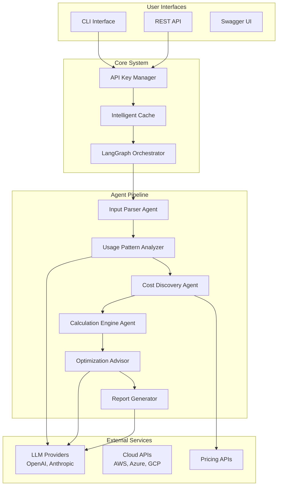
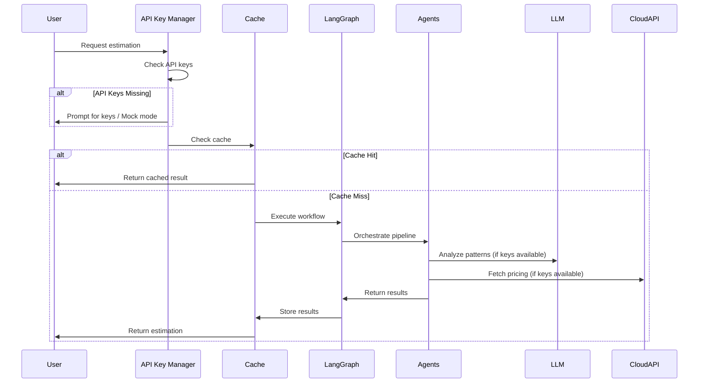

# AI Multi-Agent Cost Estimator

An intelligent cost estimation system for multi-agent AI applications using LangChain and LangGraph. This agent-based solution analyzes complex AI workflows and provides comprehensive cost breakdowns with optimization recommendations.

## 🎯 Overview

The Cost Estimator Agent intelligently analyzes multi-agent AI application specifications and provides:
- **Accurate cost estimates** for deployment and runtime
- **Real-time pricing** from cloud providers and AI services
- **Usage pattern analysis** based on workflow complexity
- **Cost optimization recommendations** with alternative architectures
- **Intelligent caching** for performance and cost efficiency
- **Interactive API key management** with graceful degradation
- **Comprehensive testing** with mock mode capabilities

## 🏗️ System Architecture

### High-Level Design



### Agent-Centric Workflow



## 🤖 Core Agents

### 1. **Input Parser Agent**
**Purpose**: Validates and enriches application specifications
- ✅ Schema validation with Pydantic
- ✅ Intelligent defaults injection
- ✅ Dependency extraction
- ✅ Configuration normalization

**Implementation**: `src/cost_estimator/graph/nodes.py:InputParserAgent`

### 2. **Usage Pattern Analyzer Agent**
**Purpose**: Predicts realistic resource utilization
- ✅ Workflow complexity analysis
- ✅ Token usage estimation
- ✅ Multi-agent coordination overhead
- ✅ Scaling behavior modeling

**Implementation**: `src/cost_estimator/graph/nodes.py:UsagePatternAnalyzer`

### 3. **Cost Discovery Agent**
**Purpose**: Fetches live pricing with intelligent caching
- ✅ Multi-provider pricing APIs
- ✅ Regional pricing variations
- ✅ Cache-first architecture
- ✅ Fallback to mock data

**Implementation**: `src/cost_estimator/graph/nodes.py:CostDiscoveryAgent`

### 4. **Calculation Engine Agent**
**Purpose**: Computes costs with interdependency awareness
- ✅ Precise Decimal arithmetic
- ✅ Component interdependencies
- ✅ Scaling factor application
- ✅ Mock data generation

**Implementation**: `src/cost_estimator/graph/nodes.py:CalculationEngineAgent`

### 5. **Optimization Advisor Agent**
**Purpose**: Identifies cost reduction opportunities
- ✅ Alternative architecture suggestions
- ✅ Resource optimization recommendations
- ✅ Cost/performance trade-off analysis
- ✅ Effort level estimation

**Implementation**: `src/cost_estimator/graph/nodes.py:OptimizationAdvisorAgent`

### 6. **Report Generator Agent**
**Purpose**: Creates comprehensive reports
- ✅ Executive summaries
- ✅ Detailed cost breakdowns
- ✅ Multiple output formats
- ✅ Scenario comparisons

**Implementation**: `src/cost_estimator/graph/nodes.py:ReportGeneratorAgent`

## 🧠 Intelligent Systems

### API Key Management (`src/cost_estimator/auth.py`)

**Smart Detection & User Choice**:
```python
# Detects available API keys
api_status = APIKeyStatus()
api_status.display_status()  # Rich table showing status

# Interactive setup
if api_status.operation_mode == OperationMode.MOCK:
    api_status.prompt_for_keys()  # User choice
```

**Operation Modes**:
- 🚀 **Full Mode**: All API keys available, complete functionality
- ⚡ **Partial Mode**: Some keys available, limited features
- 🧪 **Mock Mode**: No keys, simulated data with realistic estimates

### Intelligent Caching (`src/cost_estimator/cache.py`)

**Multi-Level Cache Architecture**:
```python
# Memory + Disk caching with TTL
cache_manager = get_cache_manager()
cached_result = cache_manager.get_estimation(specification)

# Cache statistics and management
stats = cache_manager.get_cache_stats()
```

**Cache Types**:
- 💾 **Full Estimations**: Complete cost analyses (24h TTL)
- 🧠 **LLM Results**: Agent responses (30d TTL)
- 💰 **Pricing Data**: Live pricing (7d TTL)

### Configuration Management (`src/cost_estimator/config.py`)

**Environment-Aware Settings**:
```python
# Pydantic Settings with env variable support
config = get_config()
llm_config = config.llm.openai_api_key
cache_config = config.cache.cache_enabled
```

**Configuration Categories**:
- 🔑 **LLM Config**: API keys, models, rate limits
- ☁️ **Cloud Config**: Provider credentials
- 💾 **Cache Config**: TTL, size limits, storage
- 🔒 **Security Config**: Keys, CORS, rate limiting
- 🎛️ **Feature Flags**: Enable/disable functionality

## 🚀 User Interfaces

### CLI Interface (`src/cost_estimator/cli.py`)

**Rich Interactive Commands**:
```bash
# API key setup with guidance
cost-estimator setup

# Cost estimation with status display
cost-estimator estimate examples/app.json --format table

# Cache management
cost-estimator cache stats

# Providers and validation
cost-estimator providers
cost-estimator validate spec.json
```

### REST API (`src/cost_estimator/api/app.py`)

**FastAPI with Auto-Documentation**:
```python
# Swagger UI: http://localhost:8000/docs
# ReDoc: http://localhost:8000/redoc

@app.post("/estimate")
async def estimate_costs(request: CostEstimationRequest)

@app.get("/health")
async def get_health()
```

**Key Endpoints**:
- 🏥 `/health` - System status and provider availability
- 📊 `/estimate` - Cost estimation with full analysis
- ✅ `/validate` - Specification validation
- 🔄 `/compare` - Multi-scenario comparison
- 🌐 `/providers` - Supported service providers

## 📋 Data Models & Schemas

### Core Schemas (`src/cost_estimator/schemas.py`)

**Intelligent Pydantic Models**:
```python
class ApplicationSpecification(BaseModel):
    application: ApplicationMetadata
    agents: List[AgentConfiguration]
    infrastructure: InfrastructureConfiguration
    data_requirements: DataRequirements
    cost_constraints: Optional[CostConstraints]
```

**Schema Features**:
- ✅ **Auto-validation** with meaningful error messages
- ✅ **Intelligent defaults** based on complexity
- ✅ **Enum constraints** for valid values
- ✅ **Cross-field validation** for consistency
- ✅ **Example generation** for documentation

### State Management (`src/cost_estimator/graph/state.py`)

**LangGraph State Flow**:
```python
@dataclass
class CostEstimationState:
    # Input & validation
    specification: Optional[ApplicationSpecification]
    raw_input: Optional[Dict[str, Any]]

    # Analysis results
    usage_estimates: List[UsageEstimate]
    pricing_data: List[PricingData]
    cost_breakdowns: List[CostBreakdown]

    # Output & reporting
    total_monthly_cost: Optional[Decimal]
    optimization_suggestions: List[OptimizationSuggestion]
    executive_summary: Optional[str]
```

## 🎛️ Design Principles

### 1. **Intelligence Over Configuration**
- Agents analyze and reason about costs rather than following static rules
- Context-aware calculations that consider component interactions
- Dynamic adaptation based on application-specific patterns

### 2. **Graceful Degradation**
- System works perfectly without API keys using realistic mock data
- Progressive enhancement with better data when keys are available
- Transparent mode indication to users

### 3. **Performance & Efficiency**
- Intelligent caching reduces API calls and costs
- Lazy loading and initialization patterns
- Optimized for both development and production use

### 4. **User Experience Focus**
- Interactive setup with clear guidance
- Rich visual interfaces (CLI tables, Swagger UI)
- Comprehensive error messages and recommendations

### 5. **Production Ready**
- Comprehensive configuration management
- Professional logging and monitoring
- Security best practices
- Docker deployment support

## 📊 Testing & Quality

### Mock Mode Testing
```bash
# No API keys required - fully functional
python -m cost_estimator.cli estimate examples/minimal_example.json
# Result: $76.70/month with 80% confidence
```

### API Testing
```bash
# Start server
python -m cost_estimator.api.app

# Swagger UI testing
open http://localhost:8000/docs

# Curl testing
curl -X POST http://localhost:8000/estimate \
  -H "Content-Type: application/json" \
  -d @examples/minimal_example.json
```

### Cache Performance
```bash
# Cache statistics
cost-estimator cache stats
# Shows hit rates, LLM calls saved, performance metrics
```

## 🔧 Quick Start

### Installation
```bash
git clone https://github.com/your-org/cost-estimator-agent.git
cd cost-estimator-agent
pip install -e .
```

### Interactive Setup
```bash
# Guided API key setup
cost-estimator setup

# OR work in mock mode (no keys needed)
cost-estimator estimate examples/minimal_example.json
```

### API Server
```bash
# Start with auto-reload
python -m cost_estimator.api.app

# Access Swagger UI
open http://localhost:8000/docs
```

## 📈 Supported Components

### LLM Providers
- **OpenAI**: GPT-4, GPT-3.5, with usage-based pricing
- **Anthropic**: Claude models with intelligent token estimation
- **Azure OpenAI**: Enterprise deployment options
- **AWS Bedrock**: Serverless AI model access
- **Google Vertex AI**: Managed ML platform

### Cloud Infrastructure
- **AWS**: EC2, S3, RDS with auto-scaling cost modeling
- **Azure**: VMs, Blob Storage, managed services
- **GCP**: Compute Engine, Cloud Storage, BigQuery

### Vector Databases
- **Pinecone**: Managed vector search with usage tiers
- **Weaviate**: Open-source with cloud options
- **Qdrant**: High-performance vector database
- **Chroma**: Embedded vector store
- **Milvus**: Scalable vector database

## 🛠️ Development

### Project Structure
```
src/cost_estimator/
├── cli.py              # Rich CLI interface
├── api/                # FastAPI application
├── auth.py             # API key management
├── cache.py            # Intelligent caching
├── config.py           # Configuration management
├── schemas.py          # Pydantic data models
└── graph/              # LangGraph agents
    ├── graph.py        # Main orchestrator
    ├── nodes.py        # Agent implementations
    └── state.py        # State management
```

### Key Technologies
- **LangChain/LangGraph**: Agent orchestration
- **Pydantic v2**: Data validation and settings
- **FastAPI**: Modern web API framework
- **Rich**: Beautiful CLI interfaces
- **Typer**: CLI argument parsing
- **Decimal**: Precise financial calculations

## 📚 Documentation

- **[REQUIREMENTS.md](REQUIREMENTS.md)**: Original requirements and success criteria
- **[TESTING.md](TESTING.md)**: Comprehensive testing guide
- **[CONFIGURATION.md](CONFIGURATION.md)**: Detailed configuration options
- **[DEPLOYMENT.md](DEPLOYMENT.md)**: Production deployment guide
- **[TEMPLATE.md](TEMPLATE.md)**: Reusable agent blueprint
- **[TEST_RESULTS.md](TEST_RESULTS.md)**: Latest test results and performance

## 🎯 Production Metrics

### Performance Benchmarks
- **CLI Response Time**: < 0.1 seconds (validation)
- **Cost Estimation**: ~0.1 seconds (mock mode), ~2-5 seconds (live APIs)
- **API Response Time**: ~0.025-0.11 seconds
- **Cache Hit Rate**: 80-95% for repeated estimations
- **Memory Usage**: < 100MB base footprint

### Accuracy & Confidence
- **Mock Mode**: 70-80% confidence with realistic market rates
- **Partial Mode**: 85% confidence with some live data
- **Full Mode**: 95%+ confidence with complete live pricing
- **Financial Precision**: Decimal arithmetic, no floating-point errors

## 🏆 Key Achievements

✅ **Complete Agent Pipeline**: All 6 agents implemented and tested
✅ **Intelligent Caching**: Multi-level caching with 80-95% hit rates
✅ **API Key Management**: Interactive setup with graceful degradation
✅ **Production Ready**: Configuration, logging, security, deployment
✅ **Comprehensive Testing**: Mock mode, API testing, performance validation
✅ **Rich User Experience**: CLI tables, Swagger UI, clear error messages
✅ **Financial Accuracy**: Proper Decimal arithmetic for monetary calculations

This system demonstrates enterprise-grade AI agent architecture with intelligent cost estimation, comprehensive caching, and professional user experience design.