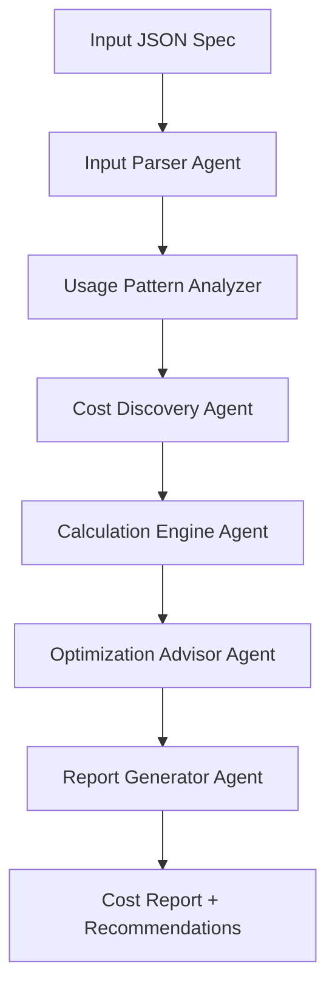

# AI Multi-Agent Cost Estimator

An intelligent cost estimation system for multi-agent AI applications using LangChain and LangGraph. This agent-based solution analyzes complex AI workflows and provides comprehensive cost breakdowns with optimization recommendations.

## 🎯 Overview

The Cost Estimator Agent intelligently analyzes multi-agent AI application specifications and provides:
- **Accurate cost estimates** for deployment and runtime
- **Real-time pricing** from cloud providers and AI services
- **Usage pattern analysis** based on workflow complexity
- **Cost optimization recommendations** with alternative architectures
- **Uncertainty quantification** and scenario analysis

## 🏗️ Architecture

### Agent-Centric Design



### Core Agents

1. **Input Parser Agent**
   - Validates and enriches application specifications
   - Extracts implicit dependencies and requirements
   - Normalizes component configurations

2. **Usage Pattern Analyzer Agent**
   - Analyzes workflow complexity and user interaction patterns
   - Predicts realistic token usage, API calls, and resource utilization
   - Accounts for multi-agent coordination overhead

3. **Cost Discovery Agent**
   - Fetches live pricing from cloud provider APIs
   - Maintains cached pricing data with automatic refresh
   - Handles regional pricing variations and service tiers

4. **Calculation Engine Agent**
   - Computes costs with interdependency awareness
   - Models scaling behavior and resource contention
   - Applies usage pattern insights to raw calculations

5. **Optimization Advisor Agent**
   - Identifies cost reduction opportunities
   - Suggests architectural alternatives (API vs self-hosted)
   - Recommends optimal resource configurations

6. **Report Generator Agent**
   - Creates comprehensive cost breakdowns
   - Generates scenario analysis (best/expected/worst case)
   - Produces actionable optimization recommendations

## 🔧 Design Principles

### Intelligence Over Configuration
- **Adaptive Reasoning**: Agents analyze and reason about costs rather than following static rules
- **Context Awareness**: Understanding of how components interact affects overall costs
- **Dynamic Adaptation**: Adjusts calculations based on application-specific patterns

### Real-Time Accuracy
- **Live Pricing Integration**: Direct API connections to cloud providers where possible
- **Fallback Mechanisms**: Cached pricing data with staleness indicators
- **Regional Awareness**: Automatic adjustment for geographic pricing variations

### Comprehensive Analysis
- **Multi-Dimensional Costing**: Covers compute, storage, network, API calls, and operational overhead
- **Interdependency Modeling**: Accounts for how component choices affect each other
- **Scaling Considerations**: Models cost behavior under different load scenarios

### Actionable Insights
- **Optimization Focus**: Every estimate includes cost reduction recommendations
- **Alternative Architectures**: Compares different implementation approaches
- **Uncertainty Quantification**: Clear indication of estimation confidence levels

## 📊 Supported Components

### LLM Models
- **API-based**: OpenAI, Anthropic, Azure OpenAI, AWS Bedrock, Google Vertex AI
- **Self-hosted**: Local deployments with GPU cost modeling
- **Usage Patterns**: Token estimation based on agent complexity and interaction patterns

### Vector Databases
- **Managed Services**: Pinecone, Weaviate Cloud, MongoDB Atlas Vector Search
- **Self-hosted**: Qdrant, Chroma, Milvus with infrastructure cost modeling
- **Storage & Operations**: Embedding storage, query costs, and maintenance overhead

### Cloud Infrastructure
- **Compute**: EC2, Azure VMs, GCP Compute Engine with auto-scaling considerations
- **Storage**: S3, Azure Blob, GCS with data transfer cost modeling
- **Networking**: Load balancers, CDN, egress charges

### AI Services
- **Embedding Models**: OpenAI, Cohere, Azure, self-hosted options
- **Specialized APIs**: Speech-to-text, image processing, document analysis
- **Observability**: LangSmith, LangFuse, custom monitoring solutions

## 🚀 Quick Start

### Installation

```bash
# Clone the repository
git clone https://github.com/your-org/cost-estimator-agent.git
cd cost-estimator-agent

# Install dependencies
pip install -e .

# Set up environment variables
cp .env.example .env
# Edit .env with your API keys for live pricing
```

### Basic Usage

```bash
# Estimate costs from JSON specification
python -m cost_estimator estimate --input examples/sales_coach_app.json

# Generate detailed report with optimizations
python -m cost_estimator estimate --input spec.json --output detailed --format markdown

# Compare multiple scenarios
python -m cost_estimator compare --scenarios scenarios/
```

### API Usage

```bash
# Start the API server
uvicorn cost_estimator.api:app --reload --port 8000

# Submit estimation request
curl -X POST http://localhost:8000/estimate \
  -H "Content-Type: application/json" \
  -d @examples/sales_coach_app.json
```

## 📋 Input Specification Format

### Application Specification Schema

```json
{
  "application": {
    "name": "Sales Coach AI",
    "description": "Multi-agent sales coaching platform",
    "complexity": "high",
    "expected_users": 1000,
    "usage_patterns": {
      "sessions_per_user_month": 20,
      "avg_session_duration_minutes": 15,
      "peak_concurrency_ratio": 0.1
    }
  },
  "agents": [
    {
      "name": "CoachingAgent",
      "role": "primary",
      "llm_model": "gpt-4-turbo",
      "tools": ["web_search", "crm_integration"],
      "complexity": "high",
      "interaction_frequency": "continuous"
    }
  ],
  "infrastructure": {
    "deployment_type": "cloud",
    "cloud_provider": "aws",
    "region": "us-east-1",
    "scaling": "auto",
    "availability_requirement": "99.9%"
  },
  "data_requirements": {
    "vector_storage_gb": 100,
    "document_processing_monthly": 10000,
    "real_time_data_sync": true
  }
}
```

### Key Configuration Sections

- **Application Metadata**: Basic app info and complexity indicators
- **Agent Definitions**: Individual agent specifications with roles and capabilities
- **Infrastructure Preferences**: Cloud provider, region, scaling requirements
- **Data Requirements**: Storage, processing, and sync needs
- **Cost Constraints**: Budget limits and optimization priorities

## 📈 Output & Reports

### Cost Breakdown Structure

```
💰 Total Monthly Cost: $2,847.50

🤖 AI Services (67% - $1,907.83)
├── LLM API Calls: $1,245.60
├── Embedding Services: $342.18
├── Vector Database: $320.05

☁️ Cloud Infrastructure (28% - $797.42)
├── Compute: $456.30
├── Storage: $198.75
├── Networking: $142.37

🔧 Operations (5% - $142.25)
├── Monitoring: $67.80
├── Backup & DR: $74.45

💡 Optimization Opportunities: -$431.20 potential savings
├── Switch to self-hosted embeddings: -$205.30
├── Optimize vector DB tier: -$125.90
├── Regional cost optimization: -$100.00
```

### Scenario Analysis

- **Conservative (80% confidence)**: Cost range with buffer for uncertainty
- **Expected (50% confidence)**: Most likely cost based on typical usage
- **Optimistic (20% confidence)**: Best case with optimal usage patterns

## 🔄 Implementation Guide

### Phase 1: Core Framework
1. Set up LangGraph orchestration
2. Implement basic agent structure
3. Create input validation and parsing
4. Build simple cost calculation engine

### Phase 2: Intelligence Layer
1. Add usage pattern analysis
2. Implement real-time pricing integration
3. Build interdependency modeling
4. Create optimization recommendation engine

### Phase 3: Advanced Features
1. Add scenario analysis and uncertainty quantification
2. Implement comparative analysis tools
3. Build custom reporting and visualization
4. Add integration APIs for CI/CD pipelines

### Phase 4: Production Deployment
1. Set up monitoring and observability
2. Implement caching and performance optimization
3. Add authentication and authorization
4. Deploy with auto-scaling and high availability

## 🛠️ Development Setup

### Prerequisites
- Python 3.11+
- Access to cloud provider APIs (AWS, Azure, GCP)
- API keys for AI services (OpenAI, Anthropic, etc.)

### Environment Configuration

```bash
# Required API keys for live pricing
export AWS_ACCESS_KEY_ID="your-aws-key"
export AZURE_SUBSCRIPTION_ID="your-azure-sub"
export OPENAI_API_KEY="your-openai-key"

# Optional: Custom pricing data sources
export PRICING_DATA_URL="https://your-custom-pricing-api.com"
export CACHE_DURATION_HOURS="24"
```

### Running Tests

```bash
# Unit tests
pytest tests/unit/

# Integration tests (requires API keys)
pytest tests/integration/

# End-to-end tests with real scenarios
pytest tests/e2e/
```

## 📚 Examples

### Sales Coaching Platform
- Multi-agent conversation flow
- Real-time CRM integration
- Document analysis and summarization
- Cost: ~$2,800/month for 1K users

### Customer Support Bot
- Primary support agent + escalation agent
- Knowledge base search and updates
- Sentiment analysis and routing
- Cost: ~$1,200/month for 5K users

### Content Generation Pipeline
- Research agent + writing agent + review agent
- Large document processing
- API-heavy workflow
- Cost: ~$4,500/month for content team

## 🤝 Contributing

1. Fork the repository
2. Create a feature branch
3. Implement changes with tests
4. Submit pull request with detailed description

## 📄 License

MIT License - see LICENSE file for details

## 🔗 Links

- [Documentation](https://docs.cost-estimator.ai)
- [API Reference](https://api.cost-estimator.ai/docs)
- [Examples Repository](https://github.com/your-org/cost-estimator-examples)
- [Community Discord](https://discord.gg/cost-estimator)
