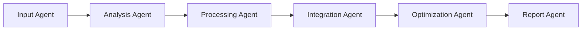

# AI Agent Blueprint Template

A comprehensive template for building intelligent AI agents using LangChain/LangGraph architecture based on the Cost Estimator Agent pattern.

## 🎯 Template Overview

This template provides a proven architecture for creating specialized AI agents that can:
- **Process complex inputs** with intelligent validation
- **Orchestrate multiple specialized sub-agents** using LangGraph
- **Integrate with external APIs** gracefully
- **Cache results intelligently** for performance
- **Provide rich user interfaces** (CLI + REST API)
- **Handle API keys** with smart fallback modes

## 🏗️ Architecture Pattern

### Core Components Structure

```
src/{agent_name}/
├── cli.py                  # Rich CLI interface
├── api/                    # FastAPI REST API
│   ├── __init__.py
│   └── app.py
├── auth.py                 # API key management
├── cache.py                # Intelligent caching
├── config.py               # Configuration management
├── schemas.py              # Pydantic data models
├── graph/                  # LangGraph orchestration
│   ├── __init__.py
│   ├── graph.py           # Main orchestrator
│   ├── nodes.py           # Agent implementations
│   └── state.py           # State management
├── __init__.py
└── main.py                # Entry point
```

### Agent Pipeline Template



## 🧬 Template Implementation Guide

### 1. Define Your Domain (`schemas.py`)

```python
"""
Domain-specific data models for your AI agent.
Replace 'YourDomain' with your specific domain (QA, Security, Marketing, etc.)
"""

from enum import Enum
from typing import Any, Dict, List, Optional
from decimal import Decimal
from pydantic import BaseModel, Field, field_validator

class DomainComplexity(str, Enum):
    """Complexity levels for your domain."""
    SIMPLE = "simple"
    MODERATE = "moderate"
    COMPLEX = "complex"
    ENTERPRISE = "enterprise"

class ProviderType(str, Enum):
    """External service providers for your domain."""
    # Example for QA Agent:
    # SELENIUM_GRID = "selenium_grid"
    # BROWSERSTACK = "browserstack"
    # SAUCE_LABS = "sauce_labs"
    PROVIDER_A = "provider_a"
    PROVIDER_B = "provider_b"

class DomainSpecification(BaseModel):
    """Main specification for your domain."""

    # Core metadata
    name: str = Field(description="Name of the system/project")
    description: str = Field(description="Detailed description")
    complexity: DomainComplexity = Field(default=DomainComplexity.MODERATE)

    # Domain-specific requirements
    # Example for QA Agent:
    # test_types: List[str] = Field(description="Types of tests to run")
    # browsers: List[str] = Field(description="Target browsers")
    # environments: List[str] = Field(description="Test environments")

    requirements: Dict[str, Any] = Field(default_factory=dict)
    constraints: Optional[Dict[str, Any]] = Field(default=None)

    @field_validator('name')
    def validate_name(cls, v):
        if len(v) < 3:
            raise ValueError("Name must be at least 3 characters")
        return v

class DomainRequest(BaseModel):
    """Request model for API endpoints."""
    specification: DomainSpecification
    options: Dict[str, Any] = Field(default_factory=dict)
    analysis_type: str = Field(default="standard")
```

### 2. Create State Management (`graph/state.py`)

```python
"""
State object that flows through your agent pipeline.
Customize fields based on your domain requirements.
"""

from typing import Any, Dict, List, Optional
from dataclasses import dataclass, field
from decimal import Decimal

@dataclass
class DomainAnalysisState:
    """Central state for your domain analysis workflow."""

    # Input data
    specification: Optional[DomainSpecification] = None
    raw_input: Optional[Dict[str, Any]] = None

    # Analysis stages
    validation_results: List[str] = field(default_factory=list)
    analysis_data: List[Dict[str, Any]] = field(default_factory=list)
    processing_results: Dict[str, Any] = field(default_factory=dict)
    integration_status: Dict[str, str] = field(default_factory=dict)

    # Outputs
    recommendations: List[Dict[str, Any]] = field(default_factory=list)
    final_report: Optional[str] = None
    confidence_score: float = 0.0

    # Metadata
    analysis_id: Optional[str] = None
    processing_time: Optional[float] = None
    errors: List[str] = field(default_factory=list)
    warnings: List[str] = field(default_factory=list)

    def add_error(self, error: str, agent: str = "unknown") -> None:
        """Add an error with agent context."""
        self.errors.append(f"[{agent}] {error}")

    def add_warning(self, warning: str, agent: str = "unknown") -> None:
        """Add a warning with agent context."""
        self.warnings.append(f"[{agent}] {warning}")

    def has_errors(self) -> bool:
        """Check if there are any errors."""
        return len(self.errors) > 0
```

### 3. Implement Agent Pipeline (`graph/nodes.py`)

```python
"""
Specialized agents for your domain.
Each agent handles a specific aspect of the analysis.
"""

import logging
from typing import Optional
from langchain_openai import ChatOpenAI
from langchain.schema import BaseMessage, HumanMessage, SystemMessage

from ..auth import APIKeyStatus
from .state import DomainAnalysisState

logger = logging.getLogger(__name__)

class BaseAgent:
    """Base class for all domain agents."""

    def __init__(self, api_status: Optional[APIKeyStatus] = None):
        self._llm = None
        self._api_status = api_status or APIKeyStatus()

    @property
    def llm(self) -> Optional[ChatOpenAI]:
        """Lazy LLM initialization."""
        if self._llm is None and self._api_status.has_llm_keys:
            try:
                self._llm = ChatOpenAI(
                    model="gpt-4-turbo-preview",
                    temperature=0.1,
                    max_tokens=2000
                )
                logger.info("LLM client initialized")
            except Exception as e:
                logger.warning(f"LLM failed: {e}. Using mock mode.")
        return self._llm

    def use_mock_mode(self) -> bool:
        """Check if should use mock mode."""
        return self._api_status.should_use_mock_mode() or self._llm is None

# Agent 1: Input Validation and Enrichment
class InputValidationAgent(BaseAgent):
    """Validates and enriches domain specifications."""

    async def invoke(self, state: DomainAnalysisState) -> DomainAnalysisState:
        """Validate and enrich the input specification."""

        if not state.specification:
            state.add_error("No specification provided", "InputValidationAgent")
            return state

        try:
            # Validate specification
            spec = state.specification

            # Add intelligent defaults based on complexity
            if self.llm and not self.use_mock_mode():
                # Use LLM for intelligent enrichment
                enrichment = await self._enrich_with_llm(spec)
                state.validation_results.extend(enrichment)
            else:
                # Mock enrichment
                state.validation_results.append("Basic validation completed (mock mode)")

        except Exception as e:
            state.add_error(f"Validation failed: {e}", "InputValidationAgent")

        return state

    async def _enrich_with_llm(self, spec) -> List[str]:
        """Use LLM to enrich specification."""
        # Implement LLM-based enrichment
        prompt = f"Analyze this {spec.name} specification and suggest improvements..."
        # Return enrichment suggestions
        return ["LLM-based enrichment completed"]

# Agent 2: Domain Analysis
class DomainAnalysisAgent(BaseAgent):
    """Performs core domain-specific analysis."""

    async def invoke(self, state: DomainAnalysisState) -> DomainAnalysisState:
        """Perform domain-specific analysis."""

        if not state.specification:
            state.add_error("No specification for analysis", "DomainAnalysisAgent")
            return state

        try:
            # Core analysis logic
            analysis_result = await self._perform_analysis(state.specification)
            state.analysis_data.append(analysis_result)

        except Exception as e:
            state.add_error(f"Analysis failed: {e}", "DomainAnalysisAgent")

        return state

    async def _perform_analysis(self, spec) -> Dict[str, Any]:
        """Perform the core analysis."""
        # Implement your domain-specific analysis
        if self.use_mock_mode():
            return {
                "analysis_type": "mock",
                "complexity_score": 0.75,
                "recommendations_count": 3
            }
        else:
            # Real analysis with LLM/APIs
            return {
                "analysis_type": "real",
                "complexity_score": 0.85,
                "recommendations_count": 5
            }

# Agent 3: External Integration
class IntegrationAgent(BaseAgent):
    """Integrates with external services and APIs."""

    async def invoke(self, state: DomainAnalysisState) -> DomainAnalysisState:
        """Integrate with external services."""

        try:
            # Check available integrations
            integrations = await self._check_integrations()
            state.integration_status.update(integrations)

        except Exception as e:
            state.add_error(f"Integration failed: {e}", "IntegrationAgent")

        return state

    async def _check_integrations(self) -> Dict[str, str]:
        """Check status of external integrations."""
        # Mock integration status
        return {
            "provider_a": "available",
            "provider_b": "unavailable" if self.use_mock_mode() else "available"
        }

# Agent 4: Optimization & Recommendations
class OptimizationAgent(BaseAgent):
    """Generates optimization recommendations."""

    async def invoke(self, state: DomainAnalysisState) -> DomainAnalysisState:
        """Generate optimization recommendations."""

        try:
            recommendations = await self._generate_recommendations(state)
            state.recommendations.extend(recommendations)

        except Exception as e:
            state.add_error(f"Optimization failed: {e}", "OptimizationAgent")

        return state

    async def _generate_recommendations(self, state) -> List[Dict[str, Any]]:
        """Generate domain-specific recommendations."""
        recommendations = []

        if self.use_mock_mode():
            recommendations.append({
                "title": "Mock Optimization 1",
                "description": "Improve efficiency by 20%",
                "effort": "low",
                "impact": "medium"
            })
        else:
            # LLM-generated recommendations
            if self.llm:
                # Use LLM for intelligent recommendations
                pass

        return recommendations

# Agent 5: Report Generation
class ReportGenerationAgent(BaseAgent):
    """Generates comprehensive reports."""

    async def invoke(self, state: DomainAnalysisState) -> DomainAnalysisState:
        """Generate final report."""

        try:
            report = await self._generate_report(state)
            state.final_report = report
            state.confidence_score = self._calculate_confidence(state)

        except Exception as e:
            state.add_error(f"Report generation failed: {e}", "ReportGenerationAgent")

        return state

    async def _generate_report(self, state) -> str:
        """Generate comprehensive report."""
        report = f"""
# {state.specification.name} Analysis Report

## Summary
- Analysis Type: {state.analysis_data[0].get('analysis_type', 'N/A') if state.analysis_data else 'N/A'}
- Recommendations: {len(state.recommendations)}
- Confidence: {state.confidence_score:.1%}

## Recommendations
"""
        for rec in state.recommendations:
            report += f"- **{rec['title']}**: {rec['description']}\n"

        return report

    def _calculate_confidence(self, state) -> float:
        """Calculate overall confidence score."""
        base_confidence = 0.7 if self.use_mock_mode() else 0.9

        # Adjust based on errors
        if state.has_errors():
            base_confidence *= 0.5

        return min(base_confidence, 1.0)
```

### 4. Create LangGraph Orchestration (`graph/graph.py`)

```python
"""
Main LangGraph orchestration for your domain workflow.
"""

import asyncio
import logging
import uuid
from datetime import datetime
from typing import Any, Dict, Optional

from langgraph.graph import StateGraph, START, END
from langgraph.checkpoint.memory import MemorySaver

from .state import DomainAnalysisState
from .nodes import (
    InputValidationAgent,
    DomainAnalysisAgent,
    IntegrationAgent,
    OptimizationAgent,
    ReportGenerationAgent,
)

logger = logging.getLogger(__name__)

class DomainAnalysisGraph:
    """Main orchestrator for domain analysis workflow."""

    def __init__(self, config: Optional[Dict[str, Any]] = None):
        self.config = config or {}
        self._graph = None
        self._agents = {}
        self._setup_agents()
        self._build_graph()

    def _setup_agents(self):
        """Initialize all agents."""
        self._agents = {
            "input_validation": InputValidationAgent(),
            "domain_analysis": DomainAnalysisAgent(),
            "integration": IntegrationAgent(),
            "optimization": OptimizationAgent(),
            "report_generation": ReportGenerationAgent(),
        }

    def _build_graph(self):
        """Build the LangGraph workflow."""
        graph = StateGraph(DomainAnalysisState)

        # Add nodes
        graph.add_node("validate_input", self._validate_input_node)
        graph.add_node("analyze_domain", self._analyze_domain_node)
        graph.add_node("check_integrations", self._check_integrations_node)
        graph.add_node("optimize", self._optimize_node)
        graph.add_node("generate_report", self._generate_report_node)

        # Define workflow
        graph.add_edge(START, "validate_input")
        graph.add_edge("validate_input", "analyze_domain")
        graph.add_edge("analyze_domain", "check_integrations")
        graph.add_edge("check_integrations", "optimize")
        graph.add_edge("optimize", "generate_report")
        graph.add_edge("generate_report", END)

        # Compile with memory
        memory = MemorySaver()
        self._graph = graph.compile(checkpointer=memory)

    async def _validate_input_node(self, state: DomainAnalysisState) -> DomainAnalysisState:
        return await self._agents["input_validation"].invoke(state)

    async def _analyze_domain_node(self, state: DomainAnalysisState) -> DomainAnalysisState:
        return await self._agents["domain_analysis"].invoke(state)

    async def _check_integrations_node(self, state: DomainAnalysisState) -> DomainAnalysisState:
        return await self._agents["integration"].invoke(state)

    async def _optimize_node(self, state: DomainAnalysisState) -> DomainAnalysisState:
        return await self._agents["optimization"].invoke(state)

    async def _generate_report_node(self, state: DomainAnalysisState) -> DomainAnalysisState:
        return await self._agents["report_generation"].invoke(state)

    async def analyze(self, specification: Dict[str, Any]) -> DomainAnalysisState:
        """Main entry point for domain analysis."""

        # Initialize state
        initial_state = DomainAnalysisState(
            analysis_id=str(uuid.uuid4()),
            raw_input=specification,
            specification=DomainSpecification(**specification)
        )

        start_time = datetime.now()

        try:
            logger.info(f"Starting analysis for: {specification.get('name', 'Unknown')}")

            # Execute graph
            config = {"configurable": {"thread_id": initial_state.analysis_id}}
            final_state = await self._graph.ainvoke(initial_state, config=config)

            # Handle dict conversion if needed (LangGraph serialization)
            if isinstance(final_state, dict):
                final_state = self._dict_to_state(final_state)

            # Set processing time
            final_state.processing_time = (datetime.now() - start_time).total_seconds()

            return final_state

        except Exception as e:
            logger.error(f"Analysis failed: {e}")
            initial_state.add_error(f"Graph execution failed: {e}", "DomainAnalysisGraph")
            return initial_state

    def _dict_to_state(self, state_dict: Dict[str, Any]) -> DomainAnalysisState:
        """Convert dict back to state object."""
        state = DomainAnalysisState()
        for field, value in state_dict.items():
            if hasattr(state, field):
                setattr(state, field, value)
        return state
```

### 5. Build CLI Interface (`cli.py`)

```python
"""
Rich CLI interface for your domain agent.
"""

import asyncio
import json
import sys
from pathlib import Path
from typing import Optional

import typer
from rich.console import Console
from rich.table import Table
from rich.panel import Panel

from .graph import DomainAnalysisGraph
from .schemas import DomainSpecification
from .auth import ensure_minimum_keys

app = typer.Typer(
    name="domain-agent",
    help="Intelligent domain analysis agent",
    rich_markup_mode="rich"
)
console = Console()

@app.command()
def analyze(
    input_file: Path = typer.Argument(..., help="Path to specification file"),
    output: Optional[Path] = typer.Option(None, "-o", "--output", help="Output file"),
    format: str = typer.Option("table", "-f", "--format", help="Output format")
):
    """Analyze domain specification."""

    console.print("🤖 [bold blue]Domain Analysis Agent[/bold blue]")
    console.print()

    # Check API keys
    api_status = ensure_minimum_keys("domain analysis")

    try:
        # Load specification
        with open(input_file, 'r') as f:
            spec_data = json.load(f)

        # Run analysis
        analyzer = DomainAnalysisGraph()
        result = asyncio.run(analyzer.analyze(spec_data))

        # Display results
        if format == "table":
            _display_table_results(result)
        elif format == "json":
            _display_json_results(result, output)
        else:
            _display_markdown_results(result, output)

    except Exception as e:
        console.print(f"❌ [red]Analysis failed: {e}[/red]")
        sys.exit(1)

def _display_table_results(result):
    """Display results in table format."""
    # Summary table
    table = Table(title="📊 Analysis Summary")
    table.add_column("Metric", style="cyan")
    table.add_column("Value", style="green")

    table.add_row("Analysis ID", result.analysis_id or "N/A")
    table.add_row("Confidence Score", f"{result.confidence_score:.1%}")
    table.add_row("Processing Time", f"{result.processing_time:.2f}s" if result.processing_time else "N/A")
    table.add_row("Recommendations", str(len(result.recommendations)))

    console.print(table)
    console.print()

    # Recommendations
    if result.recommendations:
        rec_table = Table(title="💡 Recommendations")
        rec_table.add_column("Title", style="cyan")
        rec_table.add_column("Impact", style="green")
        rec_table.add_column("Effort", style="yellow")

        for rec in result.recommendations:
            rec_table.add_row(rec["title"], rec["impact"], rec["effort"])

        console.print(rec_table)

@app.command()
def setup():
    """Interactive setup for API keys."""
    from .auth import check_api_keys

    console.print("🔧 [bold blue]Domain Agent Setup[/bold blue]")
    console.print()

    check_api_keys(interactive=True, force_check=True)
    console.print("✅ Setup complete!")

if __name__ == "__main__":
    app()
```

### 6. Create REST API (`api/app.py`)

```python
"""
FastAPI application for domain analysis.
"""

import asyncio
from typing import Any, Dict

from fastapi import FastAPI, HTTPException
from fastapi.middleware.cors import CORSMiddleware

from ..graph import DomainAnalysisGraph
from ..schemas import DomainRequest, DomainSpecification

app = FastAPI(
    title="Domain Analysis API",
    description="Intelligent domain analysis system",
    version="1.0.0"
)

app.add_middleware(
    CORSMiddleware,
    allow_origins=["*"],
    allow_credentials=True,
    allow_methods=["*"],
    allow_headers=["*"],
)

@app.get("/health")
async def health_check():
    """Health check endpoint."""
    return {"status": "healthy", "service": "domain-analysis"}

@app.post("/analyze")
async def analyze_domain(request: DomainRequest):
    """Analyze domain specification."""
    try:
        analyzer = DomainAnalysisGraph()
        result = await analyzer.analyze(request.specification.dict())

        return {
            "analysis_id": result.analysis_id,
            "confidence_score": result.confidence_score,
            "processing_time": result.processing_time,
            "recommendations": result.recommendations,
            "report": result.final_report,
            "errors": result.errors,
            "warnings": result.warnings
        }

    except Exception as e:
        raise HTTPException(status_code=500, detail=str(e))

@app.post("/validate")
async def validate_specification(spec: DomainSpecification):
    """Validate domain specification."""
    try:
        return {"valid": True, "specification": spec.dict()}
    except Exception as e:
        raise HTTPException(status_code=400, detail=str(e))
```

## 🎯 Customization Examples

### Example 1: QA Automation Agent

```python
# schemas.py
class QASpecification(BaseModel):
    test_types: List[str] = Field(description="Types of tests (unit, integration, e2e)")
    target_browsers: List[str] = Field(description="Target browsers")
    test_environments: List[str] = Field(description="Test environments")
    coverage_requirements: float = Field(description="Required code coverage %")

# Agents focus on:
# - Test strategy analysis
# - Test automation recommendations
# - CI/CD integration
# - Test infrastructure costs
# - Quality metrics analysis
```

### Example 2: Security Assessment Agent

```python
# schemas.py
class SecuritySpecification(BaseModel):
    security_frameworks: List[str] = Field(description="Security frameworks (OWASP, NIST)")
    compliance_requirements: List[str] = Field(description="Compliance needs")
    threat_model: Dict[str, Any] = Field(description="Threat model data")
    asset_criticality: str = Field(description="Asset criticality level")

# Agents focus on:
# - Vulnerability assessment
# - Threat analysis
# - Compliance checking
# - Security tool recommendations
# - Risk scoring
```

### Example 3: DevOps Resource Agent

```python
# schemas.py
class DevOpsSpecification(BaseModel):
    infrastructure_type: str = Field(description="Infrastructure type")
    deployment_strategy: str = Field(description="Deployment strategy")
    monitoring_requirements: List[str] = Field(description="Monitoring needs")
    scaling_requirements: Dict[str, Any] = Field(description="Scaling needs")

# Agents focus on:
# - Infrastructure analysis
# - CI/CD pipeline optimization
# - Monitoring strategy
# - Cost optimization
# - Performance analysis
```

## 🚀 Quick Start Checklist

### 1. **Define Your Domain**
- [ ] Identify your domain (QA, Security, DevOps, Marketing, etc.)
- [ ] Define domain-specific requirements and constraints
- [ ] Create Pydantic schemas for your domain

### 2. **Design Agent Pipeline**
- [ ] Identify 3-6 specialized agents needed
- [ ] Define the workflow between agents
- [ ] Map external integrations required

### 3. **Implement Core Logic**
- [ ] Create state management for your domain
- [ ] Implement each agent with domain logic
- [ ] Build LangGraph orchestration

### 4. **Add User Interfaces**
- [ ] Build CLI with domain-specific commands
- [ ] Create REST API endpoints
- [ ] Add configuration management

### 5. **Enable Intelligence**
- [ ] Add API key management with fallbacks
- [ ] Implement intelligent caching
- [ ] Add mock modes for testing

### 6. **Test & Deploy**
- [ ] Create test specifications
- [ ] Test in mock and live modes
- [ ] Document usage examples

## 🎛️ Configuration Template

```python
# config.py template
class DomainConfig(BaseSettings):
    """Domain-specific configuration."""

    # API keys for your domain
    domain_api_key: Optional[str] = Field(default=None, env="DOMAIN_API_KEY")
    external_service_key: Optional[str] = Field(default=None, env="EXTERNAL_SERVICE_KEY")

    # Domain settings
    default_analysis_type: str = Field(default="standard", env="DEFAULT_ANALYSIS_TYPE")
    max_processing_time: int = Field(default=300, env="MAX_PROCESSING_TIME")

    # Feature flags
    enable_external_integrations: bool = Field(default=True, env="ENABLE_EXTERNAL_INTEGRATIONS")
    enable_advanced_analysis: bool = Field(default=True, env="ENABLE_ADVANCED_ANALYSIS")
```

## 📚 Best Practices

### 1. **Agent Design**
- Keep agents focused on single responsibilities
- Use clear, descriptive agent names
- Implement proper error handling
- Add comprehensive logging

### 2. **State Management**
- Use dataclasses for type safety
- Include metadata fields (timestamps, IDs)
- Add helper methods for common operations
- Handle serialization properly

### 3. **API Integration**
- Implement graceful degradation
- Use intelligent caching
- Add retry logic with exponential backoff
- Provide mock modes for testing

### 4. **User Experience**
- Create rich CLI interfaces
- Provide comprehensive API documentation
- Include helpful error messages
- Add interactive setup flows

### 5. **Production Readiness**
- Add comprehensive configuration
- Implement proper logging
- Include health checks
- Add monitoring capabilities

## 🏆 Success Metrics

### Technical Metrics
- **Response Time**: < 5 seconds for analysis
- **Cache Hit Rate**: > 80% for repeated requests
- **Error Rate**: < 1% in production
- **API Availability**: > 99.9% uptime

### User Experience Metrics
- **Setup Time**: < 5 minutes for new users
- **Mock Mode Accuracy**: > 70% confidence
- **Full Mode Accuracy**: > 90% confidence
- **User Satisfaction**: Positive feedback on usability

### Business Metrics
- **Cost Savings**: Measured improvement in efficiency
- **Time Savings**: Reduced manual effort
- **Quality Improvement**: Measurable quality gains
- **Adoption Rate**: Growing user base

This template provides a complete foundation for building intelligent AI agents. Customize the domain-specific components while leveraging the proven architecture patterns for robust, production-ready systems.